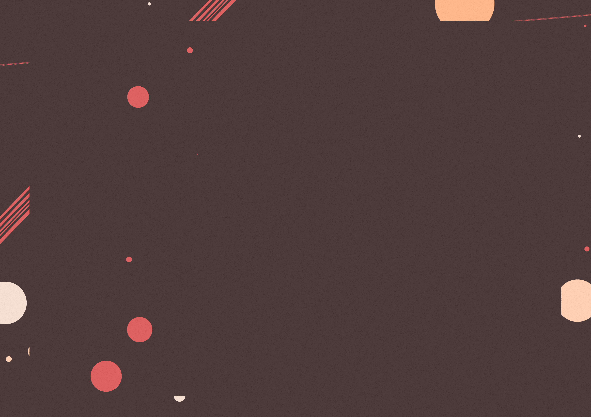

# RandomCompositions
This processing program generates random compositions. I have used these as portfolio pages.

Press `s` to save an image to `comps/composition-<pallete_nr>-<iteration-nr>`

Use the following parameters to control the output:
- `canvas_width` and `canvas_height` to set the image dimensions
- `preview_width` and `preview_height` to set the preview dimensions (can be used with `use_preview` if images exceed screen dimensions)
- `generate_batch` for batch generation (batch size is set to 10)
- `use_rect` for `0.9 * canvas_width` by `0.9 * canvas_height` (used for cleaner pages) 
  - `layer_nr` for number of layers (lines or circles) under rectangle
  - `layer_nr_over` for number of layers over rectangle
- `intersection_thold` to control the chance of two layers a having marked intersection
- `fuzzyness` to control the texture (0 being completely smooth)

